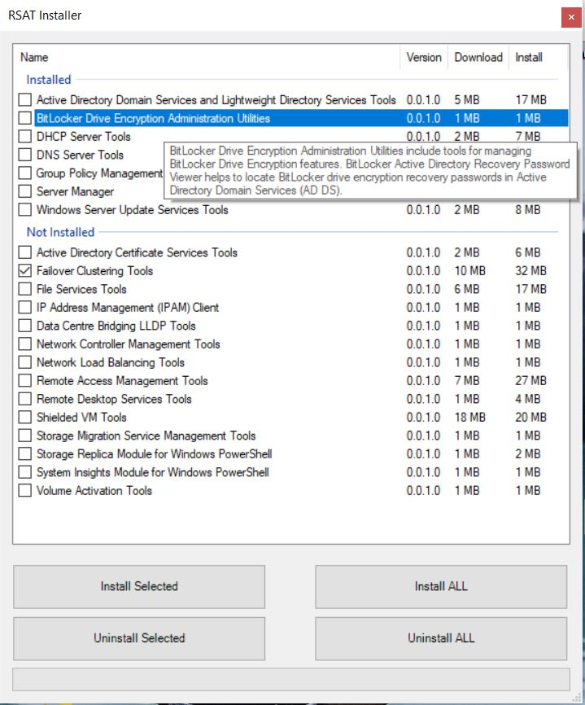

# RSAT-Installer
PowerShell WinForms based multi choice Microsoft RSAT installer

**Script requires to be run as Administrator**.

If you want to run it from context menu, just add following line on top of the script:
```
if (!([Security.Principal.WindowsPrincipal][Security.Principal.WindowsIdentity]::GetCurrent()).IsInRole([Security.Principal.WindowsBuiltInRole] "Administrator")) { Start-Process powershell.exe "-NoProfile -ExecutionPolicy Bypass -File `"$PSCommandPath`"" -Verb RunAs; exit }
```

PDQ Deploy package: make sure to run it as "**Deploy User (Interactive)**" under `PowerShell step > Options tab > Runas`

During installations the application will appear frozen, this is normal due to nature of PowerShell WinForms.

Installation of multiple selections might take few minutes to complete. Progress bar at the bottom of application will show current progress of all selected applications being installed or uninstalled.


